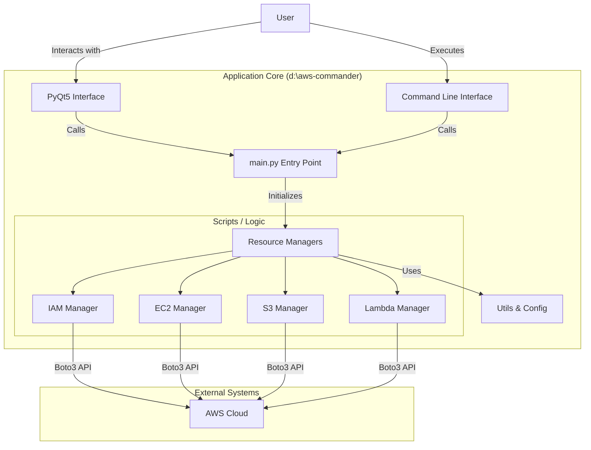

# 01 - Architecture & Tech Stack

## Tech Stack

### core

- **Language**: Python 3.x
- **SDK**: `boto3` (AWS SDK for Python)
- **GUI Framework**: `PyQt5` (Desktop Interface)

### utilities

- **Visualization**: `matplotlib`, `graphviz`
- **Configuration**: `python-dotenv`
- **HTTP**: `requests`
- **Security**: `cryptography`

### testing & quality

- **Testing**: `pytest`
- **Linting**: `black`, `flake8`

## System Architecture

## Project Goal

The **AWS Infrastructure Manager** is a hybrid Desktop GUI and CLI application designed to simplify the management and visualization of AWS Cloud resources.

It aims to provide a local control plane for:

- **Provisioning**: Setting up IAM roles, EC2 instances, S3 buckets, and Lambda functions.
- **Visualization**: Listing and inspecting existing resources.
- **Operations**: Managing common AWS tasks without navigating the AWS Console.
