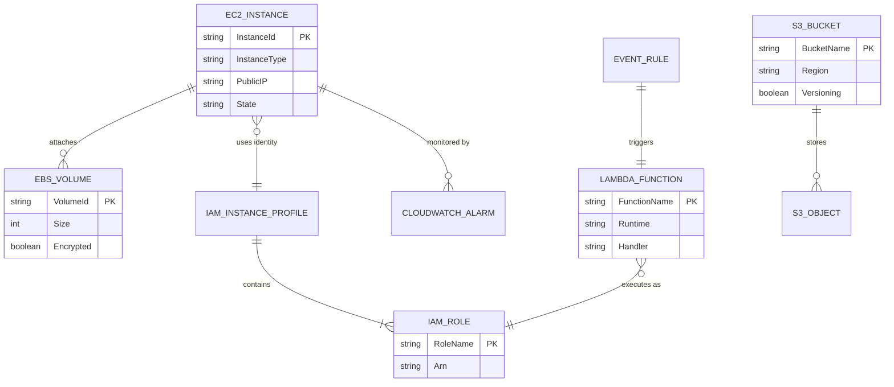

# 02 - Data Model & State

## Overview

The **AWS Infrastructure Manager** does not maintain a local relational database. Instead, it relies on the **AWS Cloud** as the "Source of Truth". Local state is limited to transient configuration and temporary file storage (uploads/downloads).

## Core Entities

The application manages the following primary AWS resources:

1. **EC2 Instance** (`EC2`)
    - **Description**: Virtual servers in the cloud.
    - **Key Attributes**: Instance ID, Type (e.g., `t2.micro`), State (running, stopped), IPs (Public/Private).
    - **Managed via**: `scripts.ec2_manager.EC2Manager`

2. **EBS Volume** (`EBS`)
    - **Description**: Block storage volumes attached to instances.
    - **Key Attributes**: Volume ID, Size (GiB), Type (gp2/io1), Encryption Status.
    - **Managed via**: `scripts.ec2_manager.EC2Manager`

3. **S3 Bucket** (`S3`)
    - **Description**: Object storage containers.
    - **Key Attributes**: Bucket Name, Region, Versioning Status, Lifecycle Policies.
    - **Managed via**: `scripts.s3_manager.S3Manager`

4. **S3 Object** (`S3Object`)
    - **Description**: Files stored within S3 buckets.
    - **Key Attributes**: Key (path/filename), Size, Content.
    - **Managed via**: `scripts.s3_manager.S3Manager`

5. **IAM Role** (`IAM`)
    - **Description**: Identity with specific permissions.
    - **Key Attributes**: Role Name, ARN, Trust Policy, Attached Policies.
    - **Managed via**: `scripts.iam_manager.IAMManager`

6. **Lambda Function** (`Lambda`)
    - **Description**: Serverless compute functions.
    - **Key Attributes**: Function Name, Runtime (`python3.9`), Handler, Memory, Timeout.
    - **Managed via**: `scripts.lambda_manager.LambdaManager`

## Entity Relationship Diagram (ERD)

## Local State Management

- **Configuration**: Managed via `.env` file and `config.settings` module.
- **Temporary Files**:
  - Uploads: `data/upload_file.txt` (Default test file)
  - Downloads: `data/downloads/` directory.
  - Logs: `logs/aws_operations.log`
