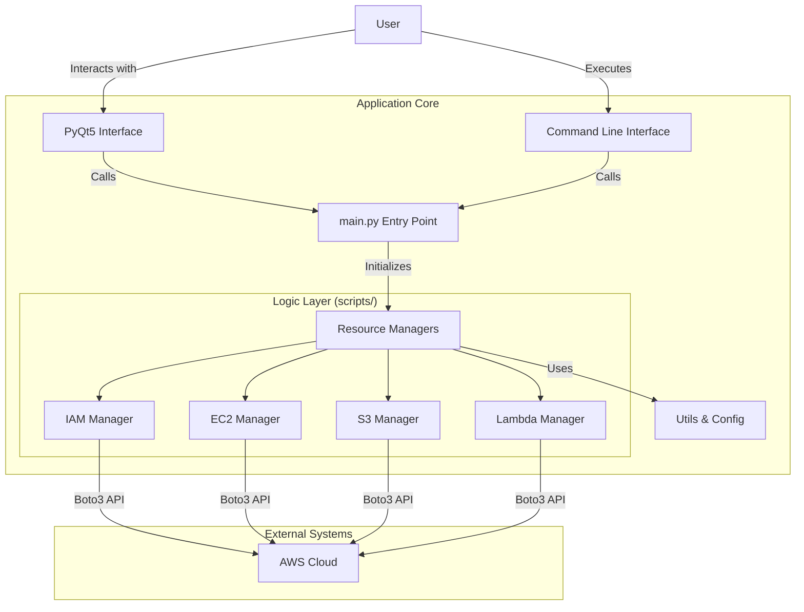

<div align="center">

# AWS Infrastructure Manager

### Your Local Control Plane for AWS Cloud


</div>

---

## 🚀 About The Project

**AWS Infrastructure Manager** is a powerful, hybrid Desktop GUI and CLI tool designed to simplify cloud resource operations. It bridges the gap between complex AWS Console navigation and raw script execution, offering a unified control plane for developers and sysadmins.

**Key Capabilities:**

- **Visual Dashboard**: Monitor EC2, S3, IAM, and Lambda resources in real-time.
- **One-Click Provisioning**: Deploy standardized infrastructure components instantly.
- **Automated Lifecycle**: Manage instance states, volume snapshots, and cleanup tasks.
- **Extensible Plugin System**: Add custom modules without altering the core codebase.

## 🏗️ Architecture

The system follows a modular architecture, separating the Presentation Layer (GUI/CLI) from the Logic Layer (Managers).



## 📂 Project Structure

```text
d:\aws-commander
├── config/                 # ⚙️ Configuration & Environment Settings
├── docs/                   # 📚 Detailed System Documentation (Phase 1)
├── plugins/                # 🧩 Extensible Plugin Modules
├── scripts/                # 🧠 Core Business Logic & Resource Managers
├── templates/              # 📝 IaC Templates (e.g., Lambda Functions)
├── aws_infra_gui_v2.py     # 🖥️ Main GUI Application Entry Point
└── main.py                 # ⌨️ CLI Entry Point & Orchestrator
```

## 📦 Module Guide

| Module | Description | Documentation |
|:---|:---|:---|
| **`scripts/`** | The "Brain" of the app. Contains `EC2Manager`, `S3Manager`, etc. | [Read the Guide](scripts/README.md) |
| **`config/`** | Centralized settings, `.env` loading, and validation logic. | [Read the Guide](config/README.md) |
| **`templates/`** | Source code for cloud-deployed resources (Infrastructure as Code). | [Read the Guide](templates/README.md) |
| **`plugins/`** | Drop-in folder for extending GUI functionality. | [Read the Guide](plugins/README.md) |

## 🏁 Getting Started

### Prerequisites

- Python 3.8+
- AWS Credentials configured (via `aws configure` or `.env`)

### Installation & Run

```bash
# 1. Clone the repository
git clone https://github.com/yourusername/aws-commander.git

# 2. Install dependencies
pip install -r requirements.txt

# 3. Configure Environment
# Copy example.env to .env and fill in your details

# 4. Run the GUI
python main.py --gui

# OR Run via CLI
python main.py setup all
```

## 📚 Documentation

For a deep dive into the system design, please refer to the **Documentation Series**:

1. [**Architecture & Tech Stack**](docs/01_ARCHITECTURE.md): Deep dive into the system design and dependencies.
2. [**Data Model & ERD**](docs/02_DATA_MODEL.md): Visualizing the relationships between EC2, S3, IAM, and Lambda.
3. [**Key Workflows**](docs/03_WORKFLOWS.md): Step-by-step breakdown of critical user journeys.
